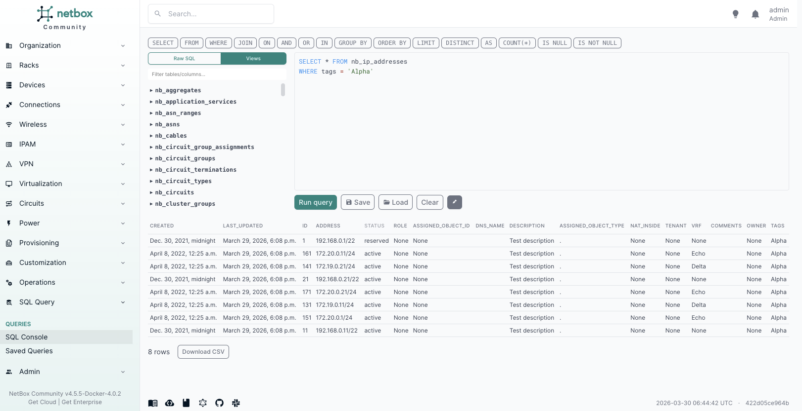
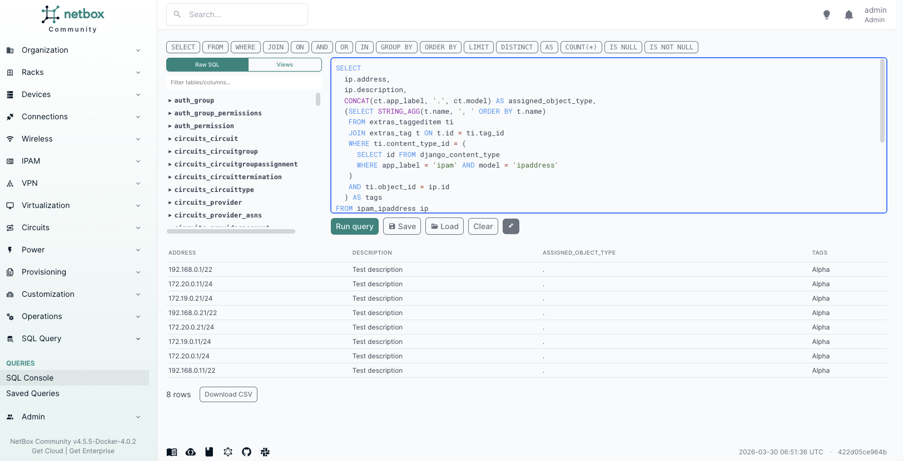
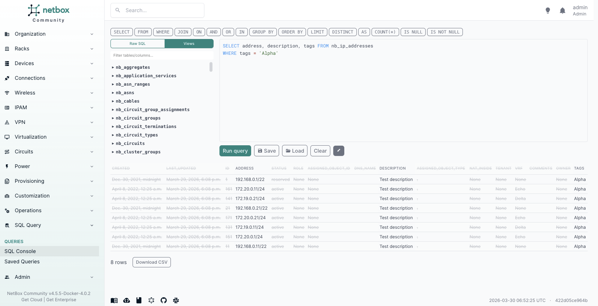
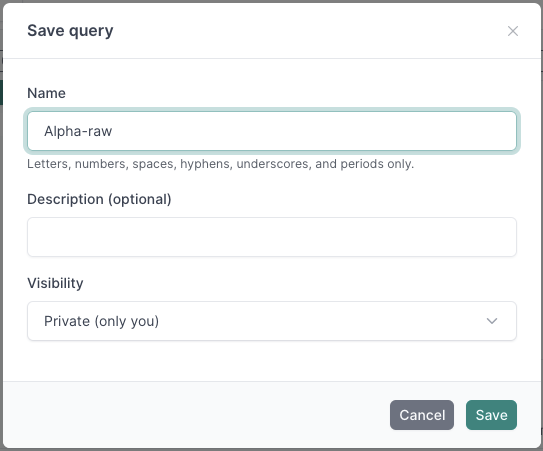
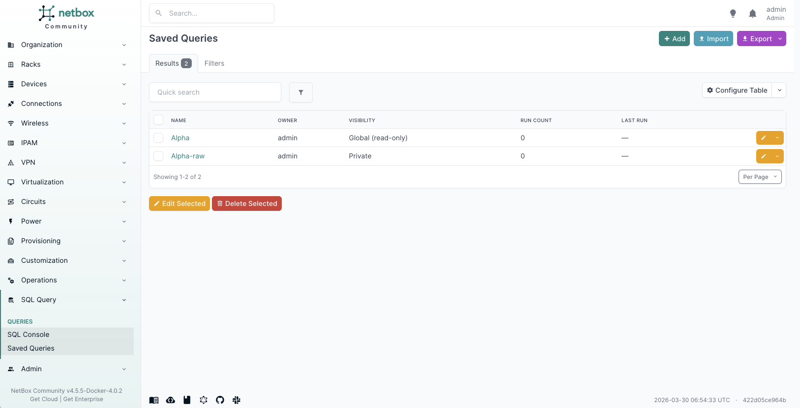
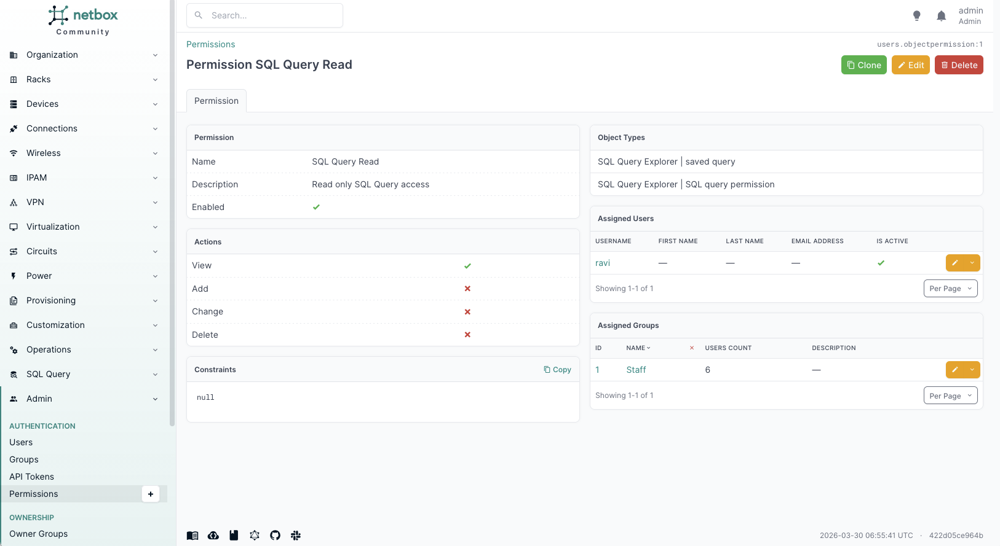
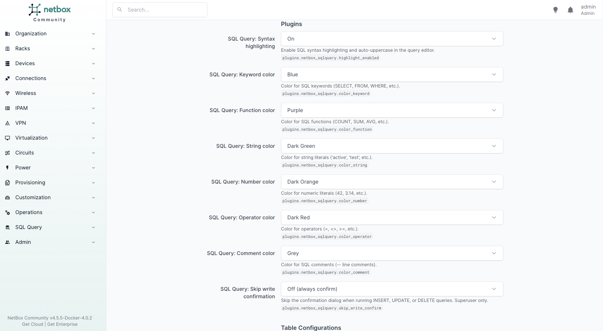

# netbox-sqlquery

A NetBox plugin that provides a SQL query interface with syntax highlighting, abstract views, saved queries, and role-based access control.

## Features

- SQL console with real-time syntax highlighting and auto-uppercase keywords
- Abstract views (`nb_*`) that resolve foreign keys to names and aggregate tags
- Schema sidebar with search filter and Raw SQL / Views toggle
- Interactive results: click columns to refine SELECT, click cells to add WHERE filters
- Saved queries with save/load dialogs and private/public visibility
- Write query support (INSERT, UPDATE, DELETE) with confirmation dialog
- Role-based access control integrated with NetBox's ObjectPermission system
- Per-user color preferences for syntax highlighting
- CSV export
- Compatible with NetBox 4.0 through 4.5, netbox-docker, and OIDC providers

## Screenshots

### Views mode
Query abstract views that resolve foreign keys and aggregate tags, matching how data appears in the NetBox UI.



### Raw SQL mode
Query the database directly with full PostgreSQL power.



### Column select
Click column headers to refine which columns are returned.



### Saving queries
Save queries for reuse with private or public visibility.



### Saved queries list



### Permissions setup
Control access using NetBox's native ObjectPermission system.



### User preferences
Customize syntax highlighting colors per user.



## Compatibility

See [COMPATIBILITY.md](COMPATIBILITY.md) for the full version matrix.

| NetBox version | Python versions              |
|----------------|------------------------------|
| 4.0 - 4.5      | 3.10, 3.11, 3.12, 3.13, 3.14 |

## Installation

```bash
pip install netbox-sqlquery
```

Add to your NetBox `configuration.py`:

```python
PLUGINS = ["netbox_sqlquery"]

PLUGINS_CONFIG = {
    "netbox_sqlquery": {
        "require_superuser": True,
        "max_rows": 1000,
        "statement_timeout_ms": 10000,
        "deny_tables": [
            "auth_user",
            "users_token",
            "users_userconfig",
        ],
    }
}
```

Run migrations:

```bash
python manage.py migrate netbox_sqlquery
```

Collect static files:

```bash
python manage.py collectstatic --no-input
```

For Docker-based installations, see [docs/docker.md](docs/docker.md).

## Configuration

| Setting                | Type | Default                                            | Description                                           |
|------------------------|------|----------------------------------------------------|-------------------------------------------------------|
| `require_superuser`    | bool | `True`                                             | Require superuser to access the query view            |
| `max_rows`             | int  | `1000`                                             | Maximum rows returned per query                       |
| `statement_timeout_ms` | int  | `10000`                                            | PostgreSQL statement timeout in milliseconds          |
| `deny_tables`          | list | `["auth_user", "users_token", "users_userconfig"]` | Tables blocked for all users including superusers     |
| `top_level_menu`       | bool | `False`                                            | Show as a top-level nav menu instead of under Plugins |

## Documentation

- [Installation](docs/installation.md)
- [Configuration](docs/configuration.md)
- [Usage](docs/usage.md)
- [Permissions](docs/permissions.md)
- [Saved queries](docs/saved-queries.md)
- [Operations](docs/operations.md)
- [Docker](docs/docker.md)
- [Uninstalling](docs/uninstall.md)

## License

Apache 2.0. See [LICENSE](LICENSE).
