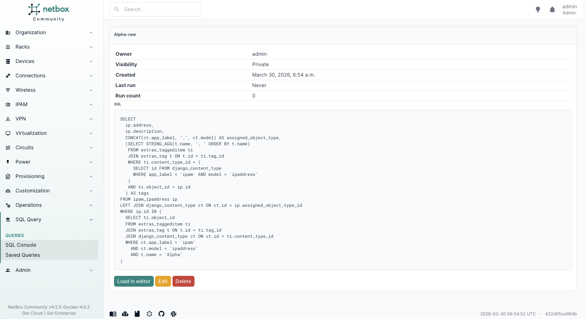

# Saved queries

Saved queries let users store and reuse SQL queries within the plugin.

## Saving a query

1. Write or run a query in the editor
2. Click the **Save** button (floppy disk icon) next to Run query
3. Enter a name, optional description, and visibility level
4. Click Save


Query names must start with a letter or number and can contain letters, numbers, spaces, hyphens, underscores, and periods. Special characters are rejected to prevent injection attacks.

## Loading a saved query

1. Click the **Load** button (folder icon) next to Save
2. A dialog shows all queries visible to you, with a search bar
3. Click a query to load it into the editor

## Visibility levels

- **Private**: Only visible to you.
- **Public (read-only)**: Visible to all authenticated users. Only you can edit or delete it.

## Managing saved queries

The full list of saved queries is available at SQL Query > Saved Queries (or `/plugins/sqlquery/saved-queries/`). From there you can view, edit, and delete queries.


Clicking a query name shows its details:



## REST API

The API supports full CRUD operations:

```
GET    /api/plugins/sqlquery/saved-queries/
POST   /api/plugins/sqlquery/saved-queries/
GET    /api/plugins/sqlquery/saved-queries/{id}/
PUT    /api/plugins/sqlquery/saved-queries/{id}/
DELETE /api/plugins/sqlquery/saved-queries/{id}/
```

The API enforces that a user cannot set `owner` to another user. Queries are always created with the requesting user as owner.
